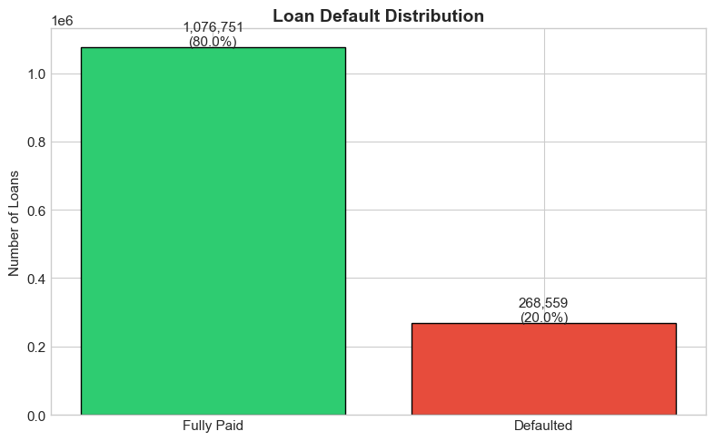
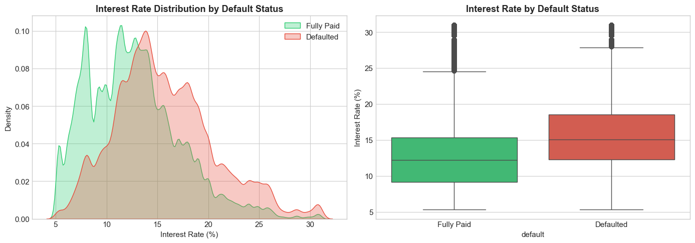
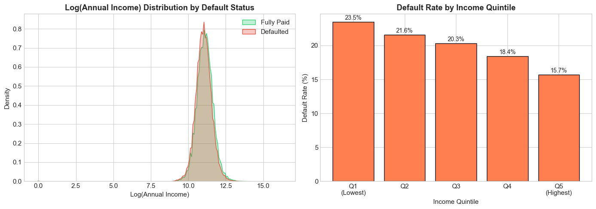
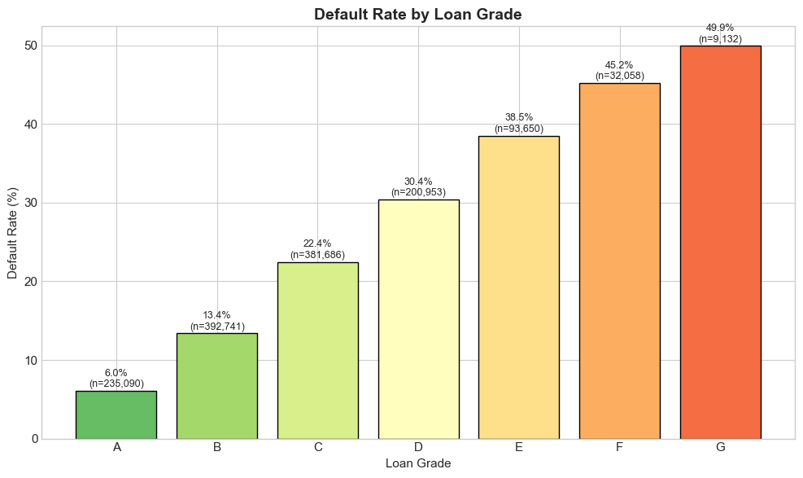
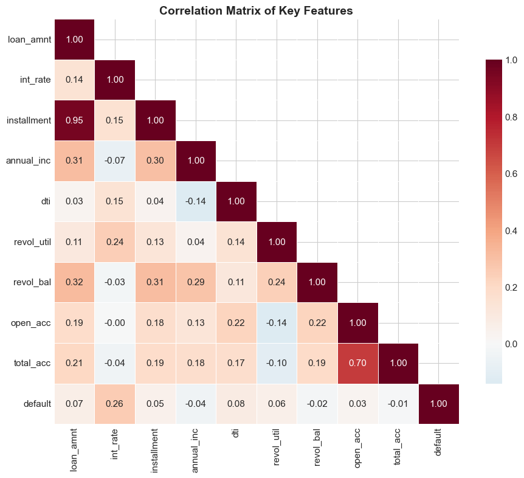
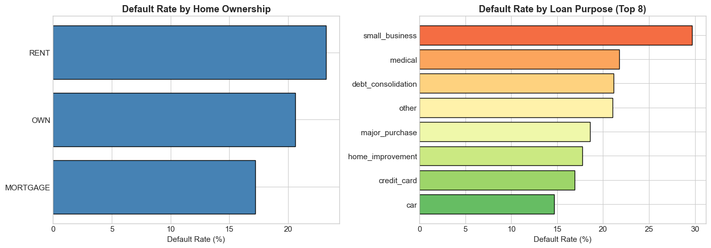
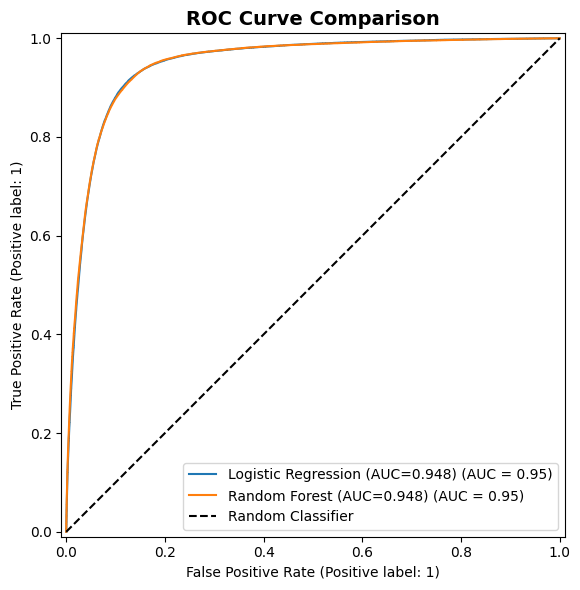
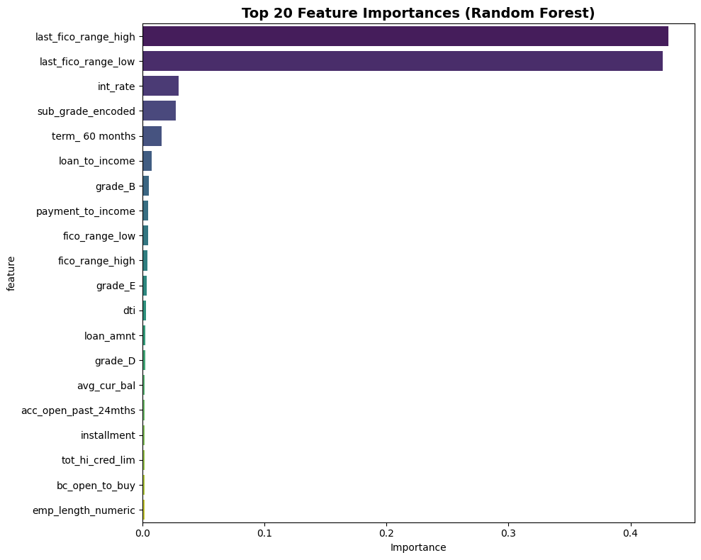

# Credit Risk Modeling

    

A machine learning pipeline for predicting loan defaults using LendingClub data. This project explores how financial institutions assess credit risk and which borrower characteristics drive default behavior.

## Overview

Banks face significant losses from loan defaults each year. This project investigates:

- What distinguishes borrowers who repay from those who default?
- Can we predict defaults before they occur?
- Which features carry the most predictive power?

## Dataset

**1.3M+ loans** from LendingClub (2007-2018) with 150+ features:

- Loan characteristics (amount, term, interest rate)
- Borrower profile (income, employment, home ownership)
- Credit history (utilization, delinquencies, inquiries)

### Target Distribution



The dataset exhibits a 20% default rate, presenting a class imbalance challenge addressed through weighted training.

## Analysis

### Interest Rate and Default Risk

Defaulted loans consistently show higher interest rates, indicating that risk-based pricing reflects genuine default probability.



### Income Distribution

Lower income quintiles show elevated default rates, though the relationship is more nuanced than expected. Borrowers across income levels demonstrate similar repayment patterns when other factors are controlled.



### Loan Grade Performance

Grade A loans default at 6%, while Grade G reaches nearly 50%. The internal grading system proves to be a reliable risk indicator.



### Feature Correlations

Interest rate (0.26 correlation) emerges as the strongest individual predictor. Income shows a weak negative correlation (-0.04) with default.



### Categorical Risk Factors

Renters default at higher rates than homeowners. Small business loans carry the highest risk at 30%.



## Model Results

| Model               | ROC-AUC |
| ------------------- | ------- |
| Logistic Regression | 0.719   |
| Random Forest       | 0.715   |
| Gradient Boosting   | 0.726   |

### ROC Curve Comparison



Gradient Boosting slightly outperforms other models. All three achieve similar performance in the 0.71-0.73 range, which is realistic for credit risk prediction without data leakage.

### Feature Importance



Sub-grade and interest rate dominate feature importance, followed by loan term and loan-to-income ratio. Origination FICO scores contribute modestly, indicating that LendingClub's internal grading system captures most credit risk signal.

## Project Structure

```
risk_modeling/
├── images/                 # Visualizations and charts
├── notebooks/
│   ├── 01_data_acquisition.ipynb
│   ├── 02_data_cleaning.ipynb
│   ├── 03_feature_engineering.ipynb
│   ├── 04_eda.ipynb
│   └── 05_modeling.ipynb
├── src/
│   └── api/
│       └── risk_scorer.py  # Scoring API
├── data/
│   ├── raw/
│   ├── interim/
│   └── processed/
├── models/
│   └── trained/
└── requirements.txt
```

## Usage

### Setup

```bash
python3 -m venv venv
source venv/bin/activate
pip install -r requirements.txt
```

### Run Notebooks

Execute notebooks 01-05 in order to reproduce the analysis.

### Scoring API

```python
from src.api.risk_scorer import CreditRiskScorer

scorer = CreditRiskScorer()
result = scorer.predict({
    "loan_amnt": 20000,
    "annual_inc": 80000,
    "int_rate": 12.5,
    "dti": 15.5,
    "grade": "B",
    "home_ownership": "RENT",
    "purpose": "debt_consolidation"
})

# Output:
# {
#     "risk_score": 42,
#     "decision": "MANUAL_REVIEW",
#     "default_probability": 0.42,
#     "confidence": "HIGH"
# }
```

## Key Takeaways

1. **Data leakage prevention** - Removed post-origination features (last FICO scores, payment history) that would not be available at loan decision time
2. **Class imbalance handling** - Applied balanced class weights to improve minority class detection
3. **Sub-grade signal** - LendingClub's internal grading system captures most predictive signal, outperforming raw FICO scores
4. **Realistic performance** - ROC-AUC of 0.72 reflects production-accurate predictions without information leakage

## Stack

pandas, numpy, scikit-learn, matplotlib, seaborn, kagglehub
